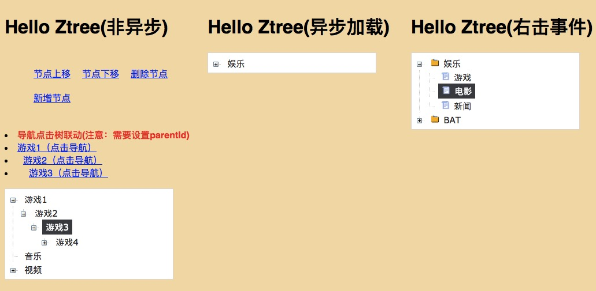

# vue-ztree-2.0

[vue-ztree-2 演示预览地址](https://lisiyizu.github.io/vue-ztree-2)

### Vue小伙伴交流群: 590688906



通过以下demo来实现

### app.vue代码如下

```html
<template>
  <div id="app">
    <h1>{{ msg }}</h1>
    <div style='width:280px;'>
      <vue-ztree :list.sync='ztreeDataSource' :func='nodeClick' :expand='expandClick' :contextmenu='contextmenuClick' :is-open='true'></vue-ztree>
    </div>
  </div>
</template>

<script>
import vueZtree from './components/vue-ztree.vue'
export default {
  data () {
    return {
      msg: 'Hello Vue-Ztree-2.0!',
      ztreeDataSource:[{
                id:1,
                name:"音乐",
                children:[],
                url:"http://www.baidu.com"
      },{
          id:2,
          name:"视频",
          children:[{
             id:3,
             name:"电影",
             children:[{
                id:4,
                name:"国产电影",
                url:""
             },{
                id:5,
                name:"好莱坞电影",
                url:""
             },{
                id:6,
                name:"小语种电影",
                url:""
             }]
          },{
             id:7,
             name:"短片",
             children:[{
                id:9,
                name:"电视剧",
                url:""
             },{
                id:10,
                name:"短片",
                url:""
             }]
          }]
      }]
    }
  },
  methods:{
    // 点击节点
    nodeClick:function(m){
       console.log(JSON.parse(JSON.stringify(m)));
    },
    // 右击事件
    contextmenuClick:function(m){
       console.log(m)
       console.log("触发了自定义的contextmenuClick事件");
    },
    // 点击展开收起
    expandClick:function(m){
       console.log(JSON.parse(JSON.stringify(m)));
       // 点击异步加载
       if(m.isExpand) {
          // 动态加载子节点, 模拟ajax请求数据
         // 请注意 id 不能重复哦。
         if(m.hasOwnProperty("children")){
            
            m.loadNode = 1; // 正在加载节点

            setTimeout(()=>{

              m.loadNode = 2; // 节点加载完毕

              m.isFolder = !m.isFolder; 

              m.children.push({
                  id:+new Date(),
                  name:"动态加载节点1",
                  path:"",
                  clickNode:false,
                  isFolder:false,
                  isExpand:false,
                  loadNode:0,
                  children:[{
                        id:+new Date()+1,
                        name:"动态加载末节点",
                        path:"",
                        clickNode:false,
                        isExpand:false,
                        isFolder:false,
                        loadNode:0
                  }]
              })
            },1000)
            
         }
       }
    }
  },
  components:{
    vueZtree
  }
}
</script>

<style>
body {font-family: Helvetica, sans-serif;}
</style>

```

###vue-ztree/初始化参数
<table  border="0" align="left">
	<tbody>
		<tr>
			<td >参数</td>
			<td >类型</td>
			<td >默认值</td>
			<td >描述</td>
		</tr>
		<tr>
			<td >list</td>
			<td >Array</td>
			<td >-</td>
			<td >树的结构数据源</td>
		</tr>
		<tr>
			<td >func</td>
			<td >Function</td>
			<td >-</td>
			<td >点击节点事件</td>
		</tr>
    <tr>
      <td >contextmenu</td>
      <td >Function</td>
      <td >-</td>
      <td >右击节点事件</td>
    </tr>
    <tr>
      <td >expand</td>
      <td >Function</td>
      <td >-</td>
      <td >点击展开/收起的方法（一般在异步加载的时候使用, 非异步加载传null）</td>
    </tr>
		<tr>
			<td >is-open</td>
			<td >Bealoon</td>
			<td >true</td>
			<td >是否展开树</td>
		</tr>
	</tbody>
</table>


## Build Setup

``` bash
# install dependencies
npm install

# serve with hot reload at localhost:8080
npm run dev

# build for production with minification
npm run build
```

For detailed explanation on how things work, consult the [docs for vue-loader](http://vuejs.github.io/vue-loader).
